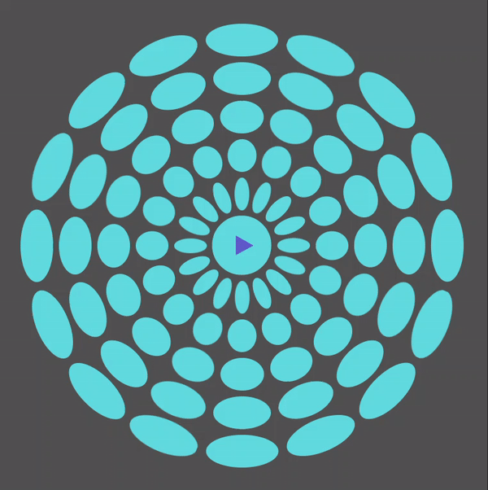
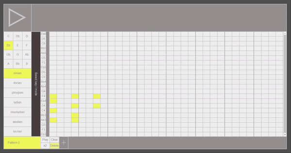
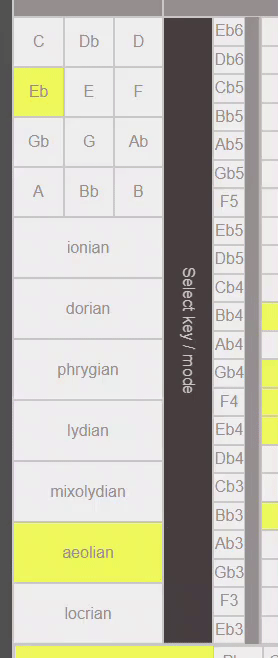
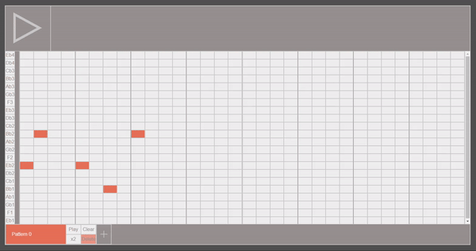

<div align="center">
  <a href="http://drooom.herokuapp.com/">
    
  </a>
</div>

**A free real-time collaborative sketchpad for jamming out your ideas remotely.**

It's time to make jamming remote-friendly! Invite your mates and draft ideas for your next big release in real time - whether they're across the hallway or the atlantic.

Setting up a meeting is easy! You'll be given a code when you start a new session. Simply copy the URL in the address bar and send it to your pals and they will join your sesh.


## Getting started

The easiest way to use the app is to visit the website:
<a href="http://drooom.herokuapp.com/">**drooom.herokuapp.com**</a>
<br/>

If you're after a local development instance, do the following

### **1. Clone the repository**
```git clone https://github.com/KozGrachev/drooom.git```
\
```cd drooom```

### **2. Install dependencies**
```npm run install-all```

### **3. Start the server**
```node index.js```

### **4. Launch the client**
```cd client```
\
```npm start```
\
The client should then open in a new browser tab. If it does not, try opening http://localhost:3000


<br/>
<br/>
<br/>
<div align="center">
  <h1>
    User manual
  </h1>
</div>

## Get wicked on the drums

The drum sequencer is bare-bones and oldschool. Resembling a hybrid between a vinyl record and a music roll (...from space 🛸), this 16-step sequencer reflects the cyclical nature of dance rhythms and encourages the user to explore by creating patterns and altering them on the fly. Labelling is omitted to further encourage experimentation.

<br />
<div align="center">
  
</div>
<br />
<br />

## Take the lead

Scroll down and uncover the polyphonic lead sequencer! Click any cell in the grid to add a note and click it again to remove it.

### ***Tip:** You can make chords by adding several notes in the same column*

Music theory not your forte? Don't worry, all the notes are already in key so you can be sure you'll never play a bum note. 😉 Click play button and see what it sounds like!

<br />
<div align="center">
  
</div>
<br />

Woah! It's in perfect time too!? 😮

Yes, drooom will always to wait until the next half bar and drop you in exactly in time! 🧙‍♂️

<br />
<div align="center">
  
</div>
<br />

Not only can you sequence melodies and chords, you have complete control over the track's harmony! Try switching between keys and modes and see how it will transform your sequence.

Unsure how the notes will sound? Try the piano roll between the sequencer and harmony panels. The notes will sound as you click them.

## Time for some Bass

Scroll down past the lead to the bass sequencer. Like the lead, it will always stay in time and in key, except it also follows the harmony of the lead. With less to worry about, you an focus on getting that groove just right 😎

<br />
<div align="center">
  
</div>
<br />
<br />

## Patterns

The lead and bass sequencers feature a patterns panel at the beneath the sequencer matrix. Create variations and add layers to your sequences.

### **Create**

Click the + symbol to the right of the last pattern to add an empty pattern to the list

### **Select**

To view a pattern simply click on the biggest button e.g. "Pattern 1"

&nbsp;&nbsp; ***Tip:** you can still see the notes of the currently playing sequence flash as they play. You can use this to create a theme that runs throughout your sequences.*

### **x2**

Inserts an identical pattern on the right

### **Clear**

Removes all notes from the pattern, leaving it empty

### **Delete**

Removes the pattern from the list entirely
